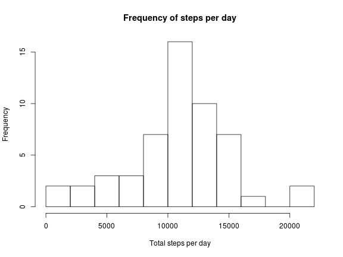
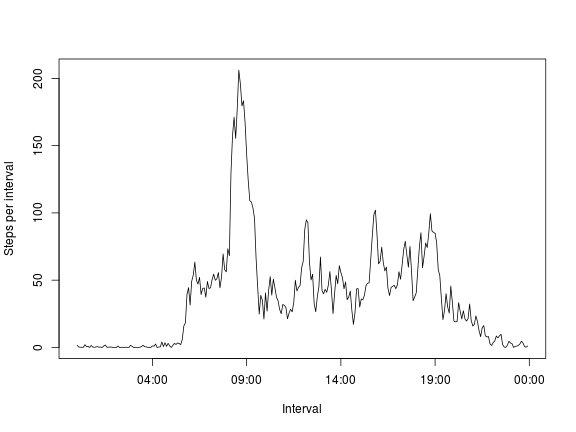
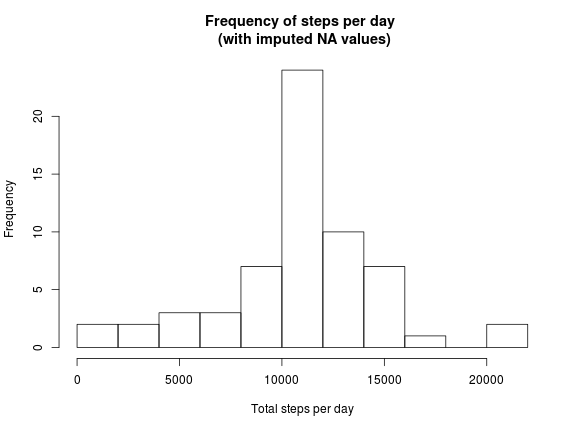
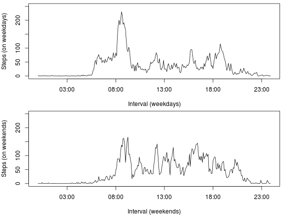

## Loading and preprocessing the data

First we will load the .csv file. Note that it is important to set your working directory to the directory, where the csv file is, using the command setwd(). Then we will show the structure of the file with the str fucntion and a summary table, using the library stargaze (which outputs well formatted tables).


```r
exercise.activity <- read.csv("activity.csv")
str(exercise.activity)
```

```
## 'data.frame':	17568 obs. of  3 variables:
##  $ steps   : int  NA NA NA NA NA NA NA NA NA NA ...
##  $ date    : Factor w/ 61 levels "2012-10-01","2012-10-02",..: 1 1 1 1 1 1 1 1 1 1 ...
##  $ interval: int  0 5 10 15 20 25 30 35 40 45 ...
```

```r
library(xtable, quietly = TRUE)
print(xtable(summary(exercise.activity)), type = "html")
```

<!-- html table generated in R 3.2.0 by xtable 1.7-4 package -->
<!-- Mon Jul 20 01:08:36 2015 -->
<table border=1>
<tr> <th>  </th> <th>     steps </th> <th>         date </th> <th>    interval </th>  </tr>
  <tr> <td align="right"> 1 </td> <td> Min.   :  0.00   </td> <td> 2012-10-01:  288   </td> <td> Min.   :   0.0   </td> </tr>
  <tr> <td align="right"> 2 </td> <td> 1st Qu.:  0.00   </td> <td> 2012-10-02:  288   </td> <td> 1st Qu.: 588.8   </td> </tr>
  <tr> <td align="right"> 3 </td> <td> Median :  0.00   </td> <td> 2012-10-03:  288   </td> <td> Median :1177.5   </td> </tr>
  <tr> <td align="right"> 4 </td> <td> Mean   : 37.38   </td> <td> 2012-10-04:  288   </td> <td> Mean   :1177.5   </td> </tr>
  <tr> <td align="right"> 5 </td> <td> 3rd Qu.: 12.00   </td> <td> 2012-10-05:  288   </td> <td> 3rd Qu.:1766.2   </td> </tr>
  <tr> <td align="right"> 6 </td> <td> Max.   :806.00   </td> <td> 2012-10-06:  288   </td> <td> Max.   :2355.0   </td> </tr>
  <tr> <td align="right"> 7 </td> <td> NA's   :2304   </td> <td> (Other)   :15840   </td> <td>  </td> </tr>
   </table>

A better looking summary is provided by the stargazer package.


```r
library(stargazer, quietly = TRUE)
```

```
## 
## Please cite as: 
## 
##  Hlavac, Marek (2015). stargazer: Well-Formatted Regression and Summary Statistics Tables.
##  R package version 5.2. http://CRAN.R-project.org/package=stargazer
```

```r
stargazer(exercise.activity, type = "html")
```


<table style="text-align:center"><tr><td colspan="6" style="border-bottom: 1px solid black"></td></tr><tr><td style="text-align:left">Statistic</td><td>N</td><td>Mean</td><td>St. Dev.</td><td>Min</td><td>Max</td></tr>
<tr><td colspan="6" style="border-bottom: 1px solid black"></td></tr><tr><td style="text-align:left">steps</td><td>15,264</td><td>37.383</td><td>111.996</td><td>0</td><td>806</td></tr>
<tr><td style="text-align:left">interval</td><td>17,568</td><td>1,177.500</td><td>692.454</td><td>0</td><td>2,355</td></tr>
<tr><td colspan="6" style="border-bottom: 1px solid black"></td></tr></table>

## What is mean total number of steps taken per day?

We can calculate this using the tapply function. This will give us an array with sums of steps for each day.

```r
dayssum <- tapply(exercise.activity$steps, exercise.activity$date, sum)

str(dayssum)
```

```
##  int [1:61(1d)] NA 126 11352 12116 13294 15420 11015 NA 12811 9900 ...
##  - attr(*, "dimnames")=List of 1
##   ..$ : chr [1:61] "2012-10-01" "2012-10-02" "2012-10-03" "2012-10-04" ...
```

Then we will make a histogram of the total number of steps taken each day. We will use the output of the "tapply" function, but converted to vector to use the data for the histogram.


```r
hist(as.vector(dayssum), breaks = 10, xlab = "Total steps per day", main= "Frequency of steps per day")
```

 


Then we calculate the mean total number of steps per day, ignoring NA data:


```r
mean(as.vector(dayssum), na.rm = TRUE)
```

```
## [1] 10766.19
```

And the median total number of steps per day:


```r
median(as.vector(dayssum), na.rm = TRUE)
```

```
## [1] 10765
```


To sum it up (using inline code chunks), mean is 1.0766189 &times; 10<sup>4</sup> and median is 10765.

## What is the average daily activity pattern?

We use the "tapply" function first to make the calculation.


```r
steps.per.interval <- tapply(exercise.activity$steps, exercise.activity$interval, mean, na.rm = TRUE)

str(steps.per.interval)
```

```
##  num [1:288(1d)] 1.717 0.3396 0.1321 0.1509 0.0755 ...
##  - attr(*, "dimnames")=List of 1
##   ..$ : chr [1:288] "0" "5" "10" "15" ...
```

We now get an array, which we need to convert further. The "names" of the array contain the intervals, but we want to convert them to time format.


```r
intervalstime <- strptime(sprintf("%04d", as.numeric(names(steps.per.interval))), format="%H%M")
```
Create a data frame to use for the plot.


```r
df.steps.per.interval <- data.frame(intervalstime, as.vector(steps.per.interval))
colnames(df.steps.per.interval) <- c("interval", "steps_per_interval")
str(df.steps.per.interval)
```

```
## 'data.frame':	288 obs. of  2 variables:
##  $ interval          : POSIXct, format: "2015-07-20 00:00:00" "2015-07-20 00:05:00" ...
##  $ steps_per_interval: num  1.717 0.3396 0.1321 0.1509 0.0755 ...
```

Now make a time series plot of the 5-minute interval and the average number of steps taken, averaged across all days:


```r
with(df.steps.per.interval, plot(steps_per_interval ~ interval, type = "l", xlab = "Interval", ylab = "Steps per interval"))
```

 


Which 5-minute interval across all the days in the dataset contains the maximum number of steps?


```r
which.max(df.steps.per.interval$steps_per_interval)
```

```
## [1] 104
```


Now we know that it is on row 104. We check to see what interval corresponds to it:


```r
df.steps.per.interval$interval[104]
```

It is the interval between 08:30 and 08:35.


## Imputing missing values

* Calculate and report the total number of missing values in the dataset.

We can do this in several ways. One is to use the "summary" command.


```r
summary(exercise.activity)
```

```
##      steps                date          interval     
##  Min.   :  0.00   2012-10-01:  288   Min.   :   0.0  
##  1st Qu.:  0.00   2012-10-02:  288   1st Qu.: 588.8  
##  Median :  0.00   2012-10-03:  288   Median :1177.5  
##  Mean   : 37.38   2012-10-04:  288   Mean   :1177.5  
##  3rd Qu.: 12.00   2012-10-05:  288   3rd Qu.:1766.2  
##  Max.   :806.00   2012-10-06:  288   Max.   :2355.0  
##  NA's   :2304     (Other)   :15840
```

The other is to use:


```r
sum(is.na(exercise.activity$steps))
```

```
## [1] 2304
```

* Devise a strategy to fill in all the missing values in the dataset.

We will use the following strategy. First, we will create a dataset from the "tapply" output of the mean of intervals. We will tweak the dataset further, so that we can merge with the original dataset. Then we will merge the two datasets by "interval".


```r
df.steps.averages <- data.frame(as.integer(names(steps.per.interval)), as.numeric(as.vector(steps.per.interval)))
colnames(df.steps.averages) <- c("interval", "steps_average")

df.exercise <- merge(exercise.activity, df.steps.averages, by = "interval")
str(df.exercise)
```

```
## 'data.frame':	17568 obs. of  4 variables:
##  $ interval     : int  0 0 0 0 0 0 0 0 0 0 ...
##  $ steps        : int  NA 0 0 0 0 0 0 0 0 0 ...
##  $ date         : Factor w/ 61 levels "2012-10-01","2012-10-02",..: 1 54 28 37 55 46 20 47 38 56 ...
##  $ steps_average: num  1.72 1.72 1.72 1.72 1.72 ...
```

We will impute the missing values with a "for" loop and an "if" clause, telling R that if a value is not available, it should use the mean value for that interval.


```r
for (i in (1:nrow(df.exercise))) {
  if (is.na(df.exercise$steps[i]) == TRUE) {
    df.exercise$steps[i] <- df.exercise$steps_average[i]
  }
}
```


* Create a new dataset that is equal to the original dataset but with the missing data filled in.

We can do this by removing the column with steps averages from the merged dataset.


```r
head(df.exercise)
```

```
##   interval    steps       date steps_average
## 1        0 1.716981 2012-10-01      1.716981
## 2        0 0.000000 2012-11-23      1.716981
## 3        0 0.000000 2012-10-28      1.716981
## 4        0 0.000000 2012-11-06      1.716981
## 5        0 0.000000 2012-11-24      1.716981
## 6        0 0.000000 2012-11-15      1.716981
```

```r
str(df.exercise)
```

```
## 'data.frame':	17568 obs. of  4 variables:
##  $ interval     : int  0 0 0 0 0 0 0 0 0 0 ...
##  $ steps        : num  1.72 0 0 0 0 ...
##  $ date         : Factor w/ 61 levels "2012-10-01","2012-10-02",..: 1 54 28 37 55 46 20 47 38 56 ...
##  $ steps_average: num  1.72 1.72 1.72 1.72 1.72 ...
```

```r
df.exercise$steps_average <- NULL

head(df.exercise)
```

```
##   interval    steps       date
## 1        0 1.716981 2012-10-01
## 2        0 0.000000 2012-11-23
## 3        0 0.000000 2012-10-28
## 4        0 0.000000 2012-11-06
## 5        0 0.000000 2012-11-24
## 6        0 0.000000 2012-11-15
```

```r
str(df.exercise)
```

```
## 'data.frame':	17568 obs. of  3 variables:
##  $ interval: int  0 0 0 0 0 0 0 0 0 0 ...
##  $ steps   : num  1.72 0 0 0 0 ...
##  $ date    : Factor w/ 61 levels "2012-10-01","2012-10-02",..: 1 54 28 37 55 46 20 47 38 56 ...
```


* Make a histogram of the total number of steps taken each day and calculate and report the mean and the median total number of steps taken per day. Do these values differ from the estimates from the first part of the assignment? What is the impact of imputing missing data of the total daily number of steps.

First, we create the histogram. To get the data for it, we need to use the "tapply" function to calculate total steps per day. Then we use the vector of the function's output as an input for the histogram.


```r
dayssum2 <- tapply(df.exercise$steps, df.exercise$date, sum)

hist(as.vector(dayssum2), breaks = 10, xlab = "Total steps per day", 
     main = "Frequency of steps per day \n (with imputed NA values)")
```

 
We also calculate the mean


```r
mean(as.vector(dayssum2))
```

```
## [1] 10766.19
```

and the median


```r
median(as.vector(dayssum2))
```

```
## [1] 10766.19
```

There is no difference for the mean before and after imputation of missing data. There is a slight difference in the median (which is now the same as the mean).

As for the total number of steps, as it is visible from the histogram, there are more steps after imputation. We can also compare this using


```r
sum(as.vector(dayssum2))
```

```
## [1] 656737.5
```

```r
sum(as.vector(dayssum), na.rm = TRUE)
```

```
## [1] 570608
```

and it confirms that the total number of steps is higher after imputation.

## Are there differences in activity patterns between weekdays and weekends?

* Create a new factor variable in the dataset with two levels - "weekday" and "weekend".

First, we will convert the "date" variable to a date format:


```r
df.exercise$date <- strptime(df.exercise$date, format = "%Y-%m-%d")
df.exercise$date <- as.POSIXct(df.exercise$date)
```

Then we will use the "weekdays" function to get the day of the week:


```r
weekdays(df.exercise$date[1])
```

```
## [1] "Monday"
```

```r
weekdays(df.exercise$date[5])
```

```
## [1] "Saturday"
```

To do this for all the observations, we will use a "for" loop with "if" and "else".


```r
for (i in c(1:nrow(df.exercise))) {
  if (weekdays(df.exercise$date[i]) == "Saturday" | 
        weekdays(df.exercise$date[i]) == "Sunday") {
    df.exercise$wkd[i] <- "weekend"
  } else {
    df.exercise$wkd[i] <- "weekday"
  }
}

head(df.exercise)
```

```
##   interval    steps       date     wkd
## 1        0 1.716981 2012-10-01 weekday
## 2        0 0.000000 2012-11-23 weekday
## 3        0 0.000000 2012-10-28 weekend
## 4        0 0.000000 2012-11-06 weekday
## 5        0 0.000000 2012-11-24 weekend
## 6        0 0.000000 2012-11-15 weekday
```

```r
str(df.exercise)
```

```
## 'data.frame':	17568 obs. of  4 variables:
##  $ interval: int  0 0 0 0 0 0 0 0 0 0 ...
##  $ steps   : num  1.72 0 0 0 0 ...
##  $ date    : POSIXct, format: "2012-10-01" "2012-11-23" ...
##  $ wkd     : chr  "weekday" "weekday" "weekend" "weekday" ...
```

We see that the new variable is of a character type. We have to convert it to a factor.


```r
df.exercise$wkd <- as.factor(df.exercise$wkd)

str(df.exercise)
```

```
## 'data.frame':	17568 obs. of  4 variables:
##  $ interval: int  0 0 0 0 0 0 0 0 0 0 ...
##  $ steps   : num  1.72 0 0 0 0 ...
##  $ date    : POSIXct, format: "2012-10-01" "2012-11-23" ...
##  $ wkd     : Factor w/ 2 levels "weekday","weekend": 1 1 2 1 2 1 2 1 1 2 ...
```

* Make a panel plot containing a time series plot of the 5-minute interval (x-axis) and the average number of steps taken, averaged across all weekday days or weekend days (y-axis).

First, we want to convert our "interval" variable to a date format in order to plot it as time series. 


```r
df.exercise$interval_converted <- strptime((sprintf("%04d", as.numeric(df.exercise$interval))), format = "%H%M")
df.exercise$interval_converted <- as.POSIXct(df.exercise$interval_converted)
```

Then we will create two new datasets, containing only weekdays and weekends, respectively.


```r
df.weekdays <- subset(df.exercise, df.exercise$wkd == "weekday")
df.weekends <- subset(df.exercise, df.exercise$wkd == "weekend")

str(df.weekdays)
```

```
## 'data.frame':	12960 obs. of  5 variables:
##  $ interval          : int  0 0 0 0 0 0 0 0 0 0 ...
##  $ steps             : num  1.72 0 0 0 0 ...
##  $ date              : POSIXct, format: "2012-10-01" "2012-11-23" ...
##  $ wkd               : Factor w/ 2 levels "weekday","weekend": 1 1 1 1 1 1 1 1 1 1 ...
##  $ interval_converted: POSIXct, format: "2015-07-20 00:00:00" "2015-07-20 00:00:00" ...
```

```r
str(df.weekends)
```

```
## 'data.frame':	4608 obs. of  5 variables:
##  $ interval          : int  0 0 0 0 0 0 0 0 0 0 ...
##  $ steps             : num  0 0 0 0 1.72 ...
##  $ date              : POSIXct, format: "2012-10-28" "2012-11-24" ...
##  $ wkd               : Factor w/ 2 levels "weekday","weekend": 2 2 2 2 2 2 2 2 2 2 ...
##  $ interval_converted: POSIXct, format: "2015-07-20 00:00:00" "2015-07-20 00:00:00" ...
```

We calculate the averages for each interval, using "tapply".


```r
weekdays.avgs <- tapply(df.weekdays$steps, df.weekdays$interval_converted, mean)
weekends.avgs <- tapply(df.weekends$steps, df.weekends$interval_converted, mean)
```

It will produce arrays and we want to make them into datasets. We do it first for weekdays.


```r
df.weekdays.avgs <- data.frame(as.POSIXct(names(weekdays.avgs)), as.vector(weekdays.avgs))
colnames(df.weekdays.avgs) <- c("interval", "steps")
str(df.weekdays.avgs)
```

```
## 'data.frame':	288 obs. of  2 variables:
##  $ interval: POSIXct, format: "2015-07-20 00:00:00" "2015-07-20 00:05:00" ...
##  $ steps   : num  2.251 0.445 0.173 0.198 0.099 ...
```

```r
head(df.weekdays.avgs)
```

```
##              interval      steps
## 1 2015-07-20 00:00:00 2.25115304
## 2 2015-07-20 00:05:00 0.44528302
## 3 2015-07-20 00:10:00 0.17316562
## 4 2015-07-20 00:15:00 0.19790356
## 5 2015-07-20 00:20:00 0.09895178
## 6 2015-07-20 00:25:00 1.59035639
```

Then for weekends.


```r
df.weekends.avgs <- data.frame(as.POSIXct(names(weekends.avgs)), as.vector(weekends.avgs))
colnames(df.weekends.avgs) <- c("interval", "steps")
str(df.weekdays.avgs)
```

```
## 'data.frame':	288 obs. of  2 variables:
##  $ interval: POSIXct, format: "2015-07-20 00:00:00" "2015-07-20 00:05:00" ...
##  $ steps   : num  2.251 0.445 0.173 0.198 0.099 ...
```

```r
head(df.weekdays.avgs)
```

```
##              interval      steps
## 1 2015-07-20 00:00:00 2.25115304
## 2 2015-07-20 00:05:00 0.44528302
## 3 2015-07-20 00:10:00 0.17316562
## 4 2015-07-20 00:15:00 0.19790356
## 5 2015-07-20 00:20:00 0.09895178
## 6 2015-07-20 00:25:00 1.59035639
```

And we are ready to plot:


```r
par(mfrow = c(2,1), mar=c(4, 4, 0.5, 1))
with(df.weekdays.avgs, plot(steps ~ interval, 
                            xlab = "Interval (weekdays)", ylab = "Steps (on weekdays)", type = "l", ylim = c(0, 250)))
with(df.weekends.avgs, plot(steps ~ interval, 
                            xlab = "Interval (weekends)", ylab = "Steps (on weekends)", type = "l", ylim = c(0, 250)))
```

 

We can see that there is a difference between the exercise patterns on weekdays and weekends. On weekdays exercise activity peaks in the morning. On weekends it is more uniformly distributed during the whole day.
